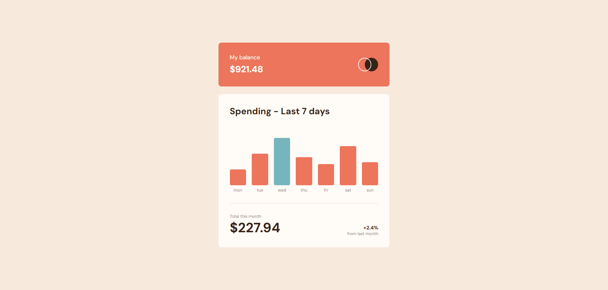

# Expenses Chart Component

This project is a solution to the [Frontend Mentor Expenses Chart Component challenge](https://www.frontendmentor.io/challenges/expenses-chart-component-e7yJBUdjwt). It involves creating a responsive expenses chart component using HTML, SCSS, and JavaScript with Vite as the build tool.

## Table of Contents

- [Overview](#overview)
  - [Screenshot](#screenshot)
  - [Links](#links)
- [My Process](#my-process)
  - [Built With](#built-with)
  - [What I Learned](#what-i-learned)
  - [Continued Development](#continued-development)

## Overview

### Screenshot

### Links

- Live Site URL: [expense-chart-component-ms.netlify.app](https://expense-chart-component-ms.netlify.app/)

## My Process

### Built With

- Semantic HTML5 markup
- SCSS
- Flexbox
- JavaScript
- Vite

### What I Learned

In this project, I learned how to create a dynamic chart using JavaScript and how to style it responsively using CSS Flexbox. I also improved my skills in handling JSON data and integrating it into the DOM. Additionally, I gained experience using Vite as a build tool and SCSS for styling.

### Continued Development

Future improvements could include adding animations to the chart bars and making the component more accessible.
